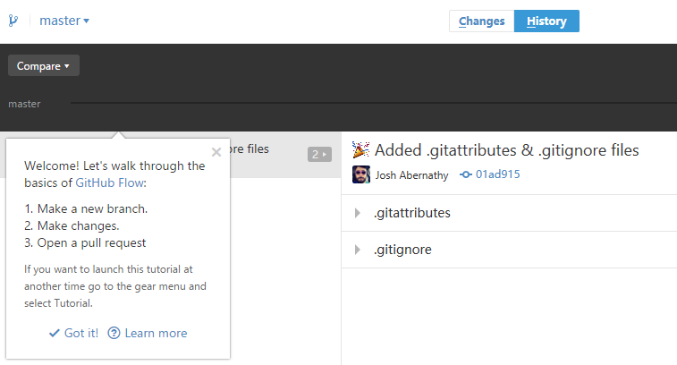
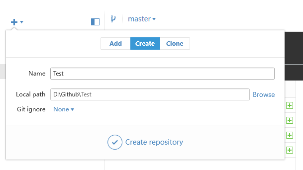
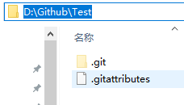
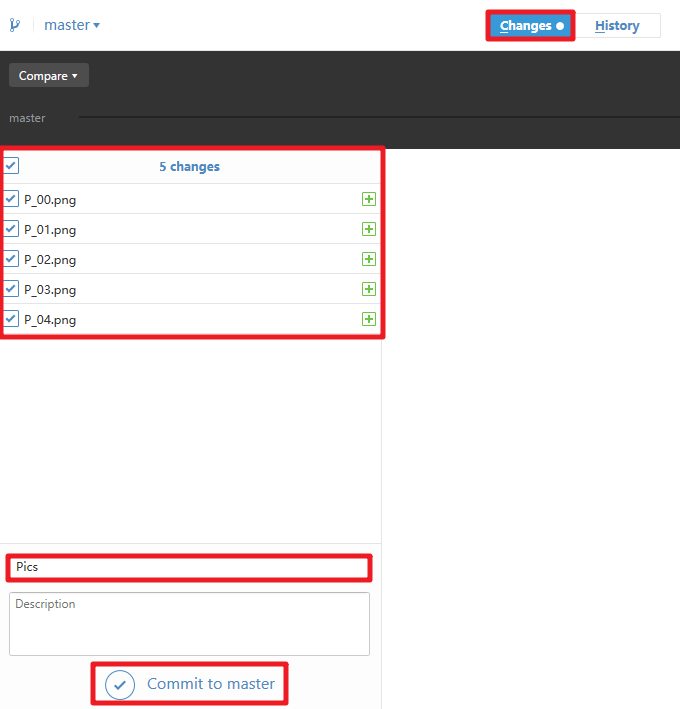
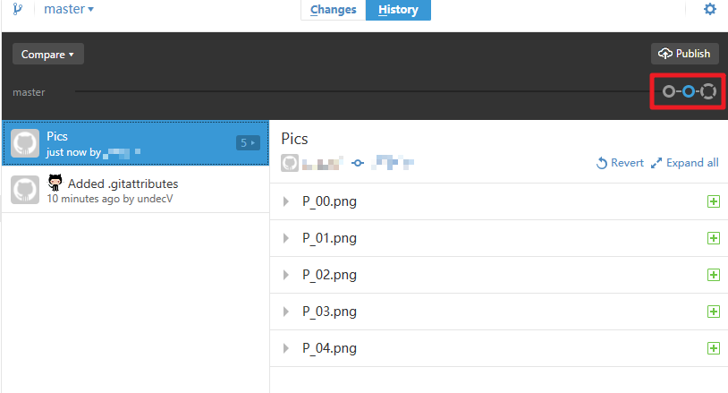

# 不用代碼也可以使用 Git

> ~~我亂說的。~~

> 從零開始的 Git 使用教程。
> **GitHub Desktop 客戶端篇。**

> Copyright © 2017 undecV.
> 
> This work is licensed under a [Creative Commons Attribution-ShareAlike 4.0 International License](http://creativecommons.org/licenses/by-sa/4.0/).

---

- 這個教程僅僅將最基本的用法：更動和提交。當然 Git 遠遠不止這麼多（水深不可測w）進一步學習，請移步 Google。

- 啊，是說 Git 不是說 GitHub，看清楚了。

  > **git** 是一個[分散式版本控制](https://zh.wikipedia.org/wiki/%E5%88%86%E6%95%A3%E5%BC%8F%E7%89%88%E6%9C%AC%E6%8E%A7%E5%88%B6)軟體，最初由[林納斯·托瓦茲](https://zh.wikipedia.org/wiki/%E6%9E%97%E7%BA%B3%E6%96%AF%C2%B7%E6%89%98%E7%93%A6%E5%85%B9)（Linus Torvalds）創作，於2005年以[GPL](https://zh.wikipedia.org/wiki/GPL)釋出。
  >
  > **GitHub** 是一個透過 [Git](https://zh.wikipedia.org/wiki/Git) 進行[版本控制](https://zh.wikipedia.org/wiki/%E7%89%88%E6%9C%AC%E6%8E%A7%E5%88%B6)的軟體原始碼代管服務，由 GitHub 公司（曾稱 Logical Awesome）的開發者 Chris Wanstrath、PJ Hyett 和 Tom Preston-Werner 使用 [Ruby on Rails](https://zh.wikipedia.org/wiki/Ruby_on_Rails) 編寫而成。
  >
  > -- Wikipedia ([CC BY-SA 3.0](https://zh.wikipedia.org/zh-tw/Wikipedia:CC_BY-SA_3.0协议文本))

  簡言之，Git 是一個工具，~~而 GitHub 則是一個以 Git 為工具的全世界最大最活躍的同性交友網站。~~

- 首先，如果你想遠離 Shell 卻想使用 Git，那麼你可能需要下載 Git 客戶端。
  在此，以 GitHub Desktop 爲例。
  啊，這裏是說  GitHub 不是說 Git，看清楚了。

- 下載並安裝 [**GitHub Desktop**](https://desktop.github.com/)。（我略！

- 當然可以先跟着軟體自帶的教程（Tutorial），瞭解 Git 在這個軟體上的基本操作。
  - 

- 設定 GitHub Desktop： 
  - 右上角的 `齒輪`，然後選擇 `Options...`。
    - 

  - 設定項目：
    1. Accounts：你的 GitHub 賬戶，點擊 `Add account` 登錄，若你還沒註冊賬戶，可以到 [GitHub](https://github.com/) 註冊一個。
    2. **※** Configure git：你的 Git 配置，要使用 Git 你需要一個全名（`Full name`）和電郵地址（`Email`），這樣 Git 才會知道誰提交了編輯。
    3. Appearance：外觀，亮或暗，你爽就好。
    4. **※** Clone path：**克隆（Clone）**的路徑，你希望 GitHub Desktop 所 Clone 的 **版本庫（Repository，或簡稱 Repo）**默認放置的地方。
    5. **※** Default shell：默認的 **殼層（Shell）**。
       - 使用 Windows 10 的童鞋，推薦選擇 `PowerShell`；
       - 使用 Windows 8 及更早版本的童鞋（電腦里沒有 `PowerShell`），推薦選擇 `CMD`；
    6. Privacy：隱私，是否希望將匿名的使用資料提交給軟體的製造者來改進他們的產品，你爽就好。
    - 請務必要設定上述被標記 **`※`** 的項目。
    - 

- 這樣，你的 GitHub Desktop 就設定完了，那麼，該如何操作 Git 呢？
  - 創立一個本地的版本庫：
    - 
  - 在上圖的資料夾中，做出更動，例如添加、刪除或修改文件，設立資料夾，就跟一般情況下使用資源管理器一樣。
    > **注意！**
    > 圖中的 `.git` 文件夾記載著你的版本訊息，請勿刪除，否則會使 Git 無法正常工作。
    - 
  - 更動結束后，回到 GitHub Desktop 中，選擇 `Change` 頁面，可以在下面看到你此次的更動，在左邊勾選你所需要提交的更動，並且在下方填寫本次更動的提要（必須）然後選擇提交。
    - 
  - 此時，你的版本庫的樹枝上就會多出一個**空心的圓**，空心的圓表示尚未**同步**，同步后，提交成功后，就會變成**實心的圓**。
    - 
  - 點擊同步，就完成了此次的提交。

- 最後，你已經完成了 GitHub Desktop 的設定，也了解的最基本的 Git 操作在 GitHub Desktop 下如何完成。那麼，下一步就是：

  - 不用代碼也可以使用 Git 系列之
    - [GitHub Desktop + GitHub 篇](GHDt+GH_V1.md) 
    - [GitHub Desktop + Bitbucket 篇](GHDt+Bb_V1.md) 

---

- See also:
  > GitHub Desktop - Simple collaboration from your desktop
  > https://desktop.github.com/

  > git - 維基百科，自由的百科全書
  > https://zh.wikipedia.org/wiki/Git

  > GIT話說從頭 | GIT教學
  > https://kingofamani.gitbooks.io/git-teach/content/chapter_2/compare.html

  > GitHub - 維基百科，自由的百科全書
  > [https://zh.wikipedia.org/wiki/Wikipedia:坏笑话和删除的胡话/GitHub](https://zh.wikipedia.org/wiki/Wikipedia:坏笑话和删除的胡话/GitHub)
  > https://zh.wikipedia.org/wiki/GitHub

- Release Notes:
  - 1.0 Publish (20170302)

